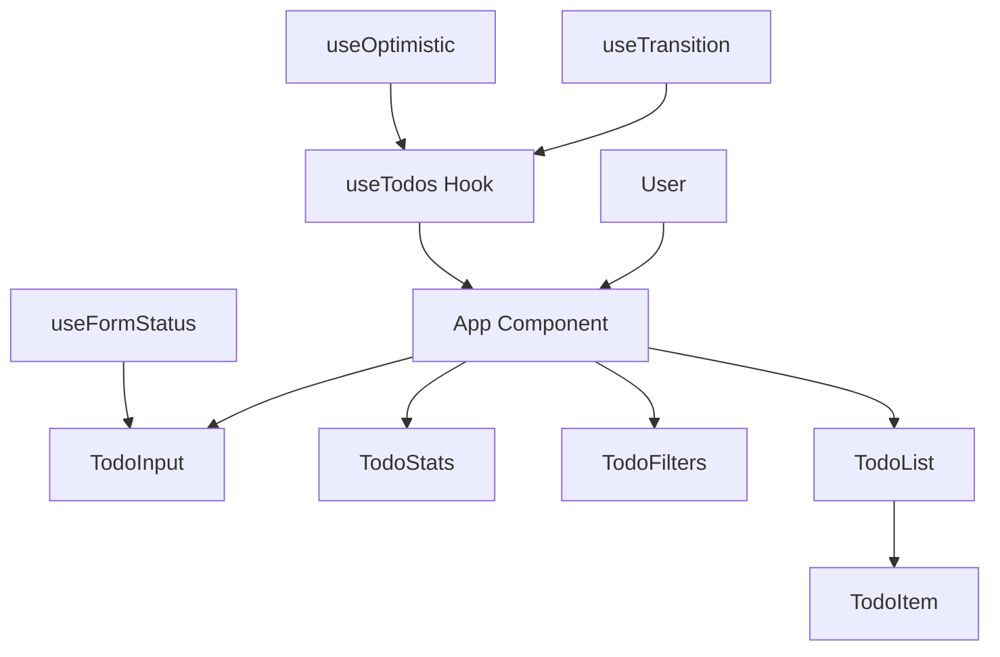
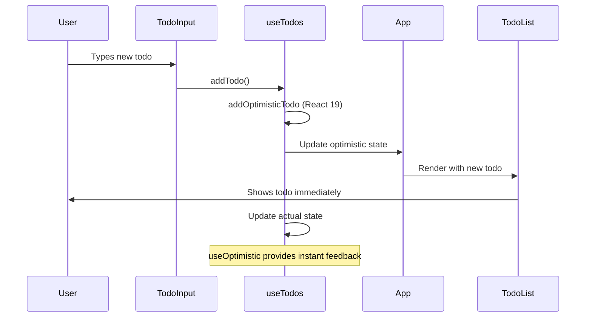
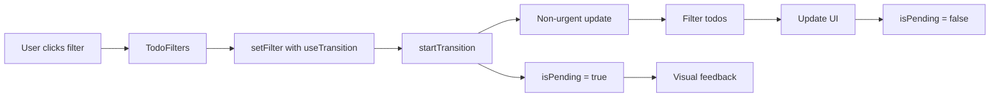

# 📝 Modern Todo Application - React 19 Edition

A beautiful, optimized Todo application showcasing **React 19** features, **TypeScript**, **Vite**, and **Tailwind CSS v4.1**. This project demonstrates modern React patterns and performance optimizations for educational purposes.

## 🚀 React 19 Features Implemented

This application showcases cutting-edge React 19 optimizations:

- **⚡ useTransition()** - Non-urgent filter updates for better performance
- **✨ useOptimistic()** - Immediate UI feedback when adding todos
- **📝 useFormStatus()** - Enhanced form state management
- **🔄 Automatic Batching** - Improved rendering performance
- **🎯 Concurrent Features** - Better user experience during state updates

## 🎯 Learning Objectives

This project teaches students about:

- **React 19 Features**: Latest React optimizations and patterns
- **Component Architecture**: Breaking down UI into reusable components
- **Custom Hooks**: Extracting and sharing logic between components
- **TypeScript**: Type safety and better development experience
- **State Management**: Using React hooks effectively with optimizations
- **Modern CSS**: Tailwind CSS for rapid styling
- **User Experience**: Animations, interactions, and accessibility

## ✨ Features

- ✅ Add, edit, and delete todos with optimistic updates
- ✅ Mark todos as complete/incomplete
- ✅ Filter todos (All, Active, Completed) with transitions
- ✅ Clear completed todos
- ✅ Progress tracking with visual progress bar
- ✅ Double-click to edit todos
- ✅ Keyboard shortcuts (Enter to add/save, Escape to cancel)
- ✅ Responsive design with glass morphism effects
- ✅ Modern animations and transitions
- ✅ Accessibility features
- ✅ React 19 performance optimizations

## 🏗️ Architecture Overview



## 🔄 Data Flow with React 19 Optimizations

### Optimistic Updates Flow



### Filter Transitions Flow



## 📁 Project Structure

```plaintext
src/
├── components/           # Reusable UI components
│   ├── TodoInput.tsx    # Input field with useFormStatus
│   ├── TodoItem.tsx     # Individual todo item with interactions
│   ├── TodoList.tsx     # List container with empty states
│   ├── TodoFilters.tsx  # Filter buttons with transition states
│   └── TodoStats.tsx    # Statistics with progress visualization
├── hooks/               # Custom React hooks
│   └── useTodos.ts      # Main state management with React 19 features
├── types/               # TypeScript type definitions
│   └── Todo.ts          # Todo interface and filter types
├── App.tsx              # Main application component
├── main.tsx            # Application entry point
├── index.css           # Global styles
└── App.css             # Component-specific styles
```

## 🧩 Component Breakdown

### 1. **App.tsx** - Main Component

The main application component orchestrating all other components with React 19 optimizations.

**Key Concepts:**

- Component composition
- React 19 feature integration
- Conditional rendering
- Performance optimization

### 2. **useTodos.ts** - Enhanced Custom Hook

A custom hook managing all todo-related state with React 19 features.

**React 19 Features:**

- `useTransition()` for non-urgent filter updates
- `useOptimistic()` for immediate UI feedback
- `useMemo()` for computed values optimization
- Functional state updates for better performance

**Key Concepts:**

- Custom hooks
- State management
- Derived state
- Performance optimization with React 19

### 3. **TodoInput.tsx** - Form Component with useFormStatus

Handles adding new todos with enhanced form state management.

**React 19 Features:**

- `useFormStatus()` for form state tracking
- Loading states and disabled inputs
- Enhanced accessibility

**Key Concepts:**

- Controlled components
- Form handling with React 19
- Event handling
- Loading state management

### 4. **TodoItem.tsx** - Individual Todo

Represents a single todo with optimized interactions.

**Key Concepts:**

- Local state management
- Event handling
- Conditional rendering
- Accessibility (ARIA labels)
- Glass morphism design

### 5. **TodoList.tsx** - List Container

Renders the list of todos with optimized empty states.

**Key Concepts:**

- List rendering
- Key props
- Empty states
- Component props

### 6. **TodoFilters.tsx** - Filter Component

Provides filtering functionality with transition states.

**React 19 Features:**

- Transition pending state visualization
- Disabled states during transitions
- Enhanced user feedback

**Key Concepts:**

- State management
- Dynamic styling
- Array methods
- Transition states

### 7. **TodoStats.tsx** - Statistics Component

Displays progress and statistics with visual feedback.

**Key Concepts:**

- Computed values
- Data visualization
- Conditional rendering
- CSS animations

## 🎨 Design System

### Colors

- **Primary**: Blue (#3B82F6)
- **Secondary**: Purple (#8B5CF6)
- **Success**: Green (#10B981)
- **Warning**: Orange (#F59E0B)
- **Error**: Red (#EF4444)
- **Glass Effects**: White with backdrop blur

### Typography

- **Font**: Inter (system fallback)
- **Sizes**: Responsive text sizing with Tailwind

### Visual Effects

- **Glass Morphism**: Backdrop blur with transparency
- **Subtle Gradients**: Soft background transitions
- **Smooth Animations**: 200ms transitions for interactions

## ⚡ React 19 Performance Optimizations

### 1. **useTransition() for Filter Updates**

```typescript
const [isPending, startTransition] = useTransition();

const updateFilter = (newFilter: FilterType) => {
  startTransition(() => {
    setFilter(newFilter);
  });
};
```

**Benefits**: Non-urgent updates don't block user interactions

### 2. **useOptimistic() for Immediate Feedback**

```typescript
const [optimisticTodos, addOptimisticTodo] = useOptimistic(
  todos,
  (state, optimisticTodo: Todo) => [optimisticTodo, ...state]
);
```

**Benefits**: UI updates immediately while actual state processes

### 3. **useFormStatus() for Form States**

```typescript
const { pending } = useFormStatus();
```

**Benefits**: Automatic form state tracking and loading indicators

### 4. **Memoized Computations**

```typescript
const filteredTodos = useMemo(() => {
  return optimisticTodos.filter(todo => {
    // filtering logic
  });
}, [optimisticTodos, filter]);
```

**Benefits**: Prevents unnecessary recalculations

## 🛠️ Getting Started

### Prerequisites

- Node.js 18+
- pnpm (recommended) or npm

### Installation

1. **Clone the repository**

   ```bash
   git clone <repository-url>
   cd my-todo
   ```

2. **Install dependencies**

   ```bash
   pnpm install
   # or
   npm install
   ```

3. **Start the development server**

   ```bash
   pnpm dev
   # or
   npm run dev
   ```

4. **Open your browser**
   Navigate to `http://localhost:5173`

### Available Scripts

```bash
pnpm dev          # Start development server
pnpm build        # Build for production
pnpm preview      # Preview production build
pnpm lint         # Run ESLint
```

## 🎓 Student Exercises

### Beginner Level

1. **Add a priority system** - Add high, medium, low priority to todos
2. **Add due dates** - Allow users to set due dates for todos
3. **Change the design** - Customize the glass morphism effects

### Intermediate Level

1. **Add categories** - Group todos by categories (work, personal, etc.)
2. **Local storage** - Persist todos in localStorage with React 19 patterns
3. **Search functionality** - Add a search bar with optimistic updates

### Advanced Level

1. **Drag and drop** - Reorder todos with React 19 concurrent features
2. **Dark mode** - Add theme switching with useTransition
3. **Real-time sync** - Use React 19 features for real-time updates

## 🔧 Technical Stack

- **React 19** - Latest React with concurrent features
- **TypeScript** - Type safety and better DX
- **Vite** - Fast build tool and dev server
- **Tailwind CSS v4.1** - Utility-first CSS framework
- **ESLint** - Code linting and formatting

## 📚 Learning Resources

### React 19 Features

- [React 19 Documentation](https://react.dev/blog/2024/04/25/react-19)
- [useTransition Hook](https://react.dev/reference/react/useTransition)
- [useOptimistic Hook](https://react.dev/reference/react/useOptimistic)
- [useFormStatus Hook](https://react.dev/reference/react-dom/useFormStatus)

### React Concepts

- [React Official Documentation](https://react.dev)
- [React Hooks](https://react.dev/reference/react)
- [Custom Hooks](https://react.dev/learn/reusing-logic-with-custom-hooks)

### TypeScript

- [TypeScript Handbook](https://www.typescriptlang.org/docs/)
- [React with TypeScript](https://react.dev/learn/typescript)

### Tailwind CSS

- [Tailwind CSS Documentation](https://tailwindcss.com/docs)
- [Tailwind CSS v4 Guide](https://tailwindcss.com/blog/tailwindcss-v4-alpha)

## 🤝 Contributing

This is a learning project! Feel free to:

- Add new React 19 features
- Improve the design
- Fix bugs
- Add more learning exercises
- Improve documentation

## 📝 Code Style Guide

### Component Structure with React 19

```tsx
// 1. Imports (React, React 19 hooks, types, components)
import { useState, useTransition, useOptimistic } from 'react';
import type { Todo } from '../types/Todo';

// 2. Interface definitions
interface ComponentProps {
  // props here
}

// 3. Component function with React 19 features
export const Component = ({ prop1, prop2 }: ComponentProps) => {
  // 4. State and hooks (React 19 first)
  const [isPending, startTransition] = useTransition();
  const [state, setState] = useState();
  
  // 5. Functions with React 19 optimizations
  const handleSomething = () => {
    startTransition(() => {
      // non-urgent updates
    });
  };
  
  // 6. Return JSX
  return (
    <div>
      {/* component JSX */}
    </div>
  );
};
```

### React 19 Best Practices

- **Use useTransition** for non-urgent updates (filters, searches)
- **Use useOptimistic** for operations that need immediate feedback
- **Use useFormStatus** for form state management
- **Prefer functional state updates** for better performance
- **Memoize expensive computations** with useMemo

## 🎉 What You've Learned

By studying this project, you've learned about:

1. **React 19 Features**
   - useTransition for concurrent updates
   - useOptimistic for optimistic UI
   - useFormStatus for form management
   - Performance optimizations

2. **Modern React Patterns**
   - Functional components
   - Custom hooks with React 19
   - Component composition
   - Performance optimization

3. **TypeScript Integration**
   - Interface definitions
   - Type safety
   - Generic types

4. **State Management**
   - Optimistic updates
   - Transition states
   - Derived state
   - Performance optimization

5. **User Experience**
   - Immediate feedback
   - Loading states
   - Smooth animations
   - Glass morphism design

6. **Code Organization**
   - Clean file structure
   - Separation of concerns
   - Reusable components
   - Performance-first approach

Happy coding with React 19! 🚀
